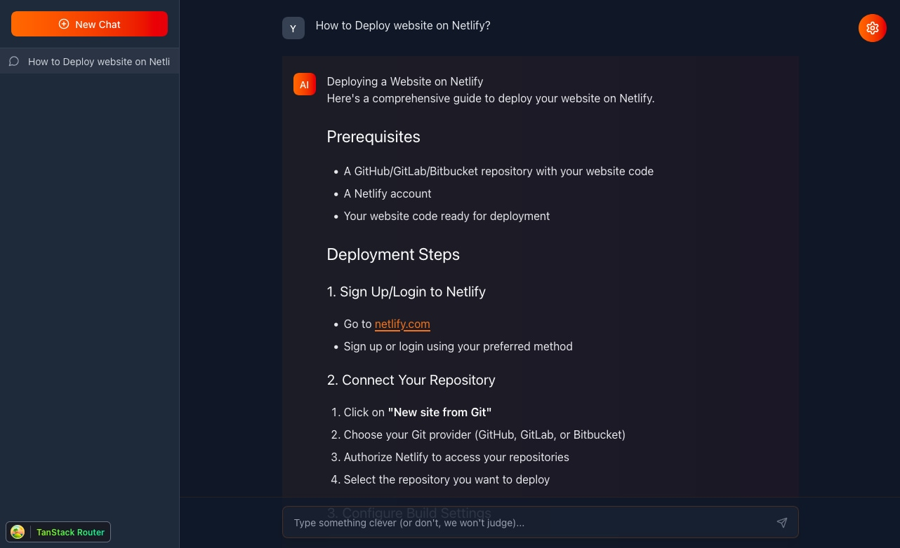

# TanStack Chat Template



A modern chat template built with TanStack Router and Claude AI integration features a clean and responsive interface.

**⚡ View demo:** [https://tanstack-starter.netlify.app/](https://tanstack-starter.netlify.app/)

## Table of Contents
- [Deploy to Netlify](#deploy-to-netlify)
- [Features](#features)
  - [AI Capabilities](#ai-capabilities)
  - [User Experience](#user-experience)
- [Project Structure](#project-structure)
  - [Key Directories](#key-directories)
- [Architecture](#architecture)
  - [Tech Stack](#tech-stack)
  - [Prerequisites](#prerequisites)
- [Getting Started](#getting-started)
  - [Local Setup](#local-setup)
  - [Local Setup with Netlify Dev](#local-setup-with-netlify-dev-recommended)
  - [Troubleshooting](#troubleshooting)
  - [Building For Production](#building-for-production)
- [Styling](#styling)
- [Error Monitoring](#error-monitoring)
- [Environment Configuration](#environment-configuration)
  - [Anthropic API Key](#anthropic-api-key)
    - [For Local Development](#for-local-development)
    - [For Netlify Deployment with AI Gateway](#for-netlify-deployment-with-ai-gateway)
    - [Using Your Own Anthropic API Key in Production](#using-your-own-anthropic-api-key-in-production)
  - [Convex Configuration (Optional)](#convex-configuration-optional)
- [Routing](#routing)
  - [Adding A Route](#adding-a-route)
  - [Adding Links](#adding-links)
  - [Using A Layout](#using-a-layout)
- [Data Fetching](#data-fetching)
- [State Management](#state-management)
- [Learn More](#learn-more)

## Deploy to Netlify

Want to deploy immediately? Click this button

[](https://app.netlify.com/start/deploy?repository=https://github.com/netlify-templates/tanstack-template)

Clicking this button will create a new repo for you that looks exactly like this one, and sets that repo up immediately for deployment on Netlify.

## Features

### AI Capabilities
- 🤖 Powered by Claude 3.5 Sonnet 
- 📝 Rich markdown formatting with syntax highlighting
- 🎯 Customizable system prompts for tailored AI behavior
- 🔄 Real-time message updates and streaming responses

### User Experience
- 🎨 Modern UI with Tailwind CSS and Lucide icons
- 🔍 Conversation management
- 🔐 API key management
- 📋 Markdown rendering with code highlighting

## Architecture

### Tech Stack
- **Frontend Framework**: React 19 with TanStack Start
- **Routing**: TanStack Router
- **State Management**: TanStack Store
- **Database**: Convex (optional)
- **Styling**: Tailwind CSS 4
- **AI Integration**: Anthropic's Claude API
- **Build Tool**: Vite 6 with Vinxi

### Prerequisites

- [Node.js](https://nodejs.org/) v20.9+
- (optional) [nvm](https://github.com/nvm-sh/nvm) for Node version management
- [Anthropic Claude API](https://www.anthropic.com/api)
- (optional) [Convex Account](https://dashboard.convex.dev/signup) for database storage

## Project Structure

The project follows a modular structure for better organization and maintainability:

```
tanstack-template/
├── convex/              # Convex database schema and functions (optional)
├── public/              # Static assets
├── src/
│   ├── components/      # Reusable UI components
│   ├── routes/          # TanStack Router route definitions
│   ├── store/           # TanStack Store state management
│   ├── utils/           # Utility functions and helpers
│   ├── api.ts           # API client configuration
│   ├── client.tsx       # Client-side entry point
│   ├── convex.tsx       # Convex client configuration
│   ├── router.tsx       # Router configuration
│   ├── sentry.ts        # Sentry error monitoring setup
│   ├── ssr.tsx          # Server-side rendering setup
│   └── styles.css       # Global styles
├── .env.example         # Example environment variables
├── app.config.ts        # Application configuration
├── package.json         # Project dependencies and scripts
├── postcss.config.ts    # PostCSS configuration for Tailwind
├── tsconfig.json        # TypeScript configuration
└── vite.config.js       # Vite bundler configuration
```

### Key Directories

- **src/components/**: Contains all reusable UI components used throughout the application
- **src/routes/**: Contains route definitions using TanStack Router's file-based routing
- **src/store/**: Contains state management logic using TanStack Store
- **convex/**: Contains Convex database schema and functions (if using Convex for persistence)

## Getting Started

### Local Setup

Follow these steps to set up and run the project locally:

1. **Clone the repository**
   ```bash
   git clone https://github.com/netlify-templates/tanstack-template.git
   cd tanstack-template
   ```

2. **Install dependencies**
   ```bash
   npm install
   ```

3. **Set up environment variables**
   ```bash
   cp .env.example .env
   ```
   
   Then edit the `.env` file with your credentials:
   - Required: Add your Anthropic API key (`ANTHROPIC_API_KEY`)
   - Optional: Add Convex URL if using database features (`VITE_CONVEX_URL`)
   - Optional: Add Sentry credentials for error monitoring (`VITE_SENTRY_DSN`, `SENTRY_AUTH_TOKEN`)

4. **Start the development server**
   ```bash
   npm run dev
   ```
   
   The application should now be running at [http://localhost:3000](http://localhost:3000)

### Local Setup with Netlify Dev (Recommended)

You can also use [Netlify Dev](https://www.netlify.com/products/dev/) to run your application locally with Netlify's full functionality:

1. **Install Netlify CLI globally** (if you haven't already)
   ```bash
   npm install -g netlify-cli
   ```

2. **Link your Netlify site** (optional)
   ```bash
   netlify link
   ```
   This will connect your local project to a Netlify site. If you haven't created a Netlify site yet, you can skip this step.

3. **Start the development server with Netlify Dev**
   ```bash
   netlify dev
   ```
   This will:
   - Start your local development server (similar to `npm run dev`)
   - Load your Netlify environment variables
   - Provide local versions of Netlify Functions (if any)
   - Simulate the Netlify production environment locally

4. **Access your site**
   The application will be available at [http://localhost:8888](http://localhost:8888) by default.

### Troubleshooting

- **Node.js version**: Ensure you're using Node.js v20.9 or higher. You can check your version with `node -v`.
  ```bash
  # Using nvm to install and use the correct Node version
  nvm install 20.9
  nvm use 20.9
  ```

- **API Key Issues**: If you encounter errors related to the Anthropic API, verify that your API key is correctly set in the `.env` file and that you have sufficient credits in your Anthropic account.

- **Port Conflicts**: If port 3000 is already in use, the development server will automatically try to use the next available port. Check your terminal output for the correct URL.

- **Convex Setup (Optional)**: If you're using Convex for database functionality:
  ```bash
  npx convex dev
  ```
  This will start the Convex development server alongside your application.

### Building For Production

To build this application for production:

```bash
npm run build
```

To preview the production build:

```bash
npm run serve
```

## Styling

This project uses [Tailwind CSS](https://tailwindcss.com/) v4 for styling.

## Error Monitoring

This project uses [Sentry](https://sentry.io) for error monitoring and performance tracking. Sentry integration is optional and the project will run normally without Sentry configuration.

To set up Sentry:

1. Add your Sentry DSN and Auth Token to your `.env` file (created during the Getting Started steps)

```
# .env file
VITE_SENTRY_DSN=your-sentry-dsn-here
SENTRY_AUTH_TOKEN=your-sentry-auth-token-here
```

If the Sentry environment variables are not defined, the application will run without error monitoring.

## Environment Configuration

**Important**: Never commit your `.env` file to version control as it contains sensitive information. The `.env` file is already included in the project's `.gitignore` file to prevent accidental commits.

### Anthropic API Key

You can generate and manage your Anthropic API keys through the [Anthropic Console](https://console.anthropic.com/login).

#### For Local Development
```
# .env file
ANTHROPIC_API_KEY=your_anthropic_api_key
```

**Important:** Use `ANTHROPIC_API_KEY` (without the `VITE_` prefix) to ensure the API key remains server-side only and is not exposed in the client-side bundle.

#### For Netlify Deployment with AI Gateway

This template works seamlessly with [Netlify AI Gateway](https://docs.netlify.com/build/ai-gateway/overview/), which automatically proxies your Anthropic API requests with built-in security, usage analytics, and rate limiting.

**How it works:**
1. Deploy to Netlify
2. AI Gateway automatically handles all requests to `api.anthropic.com`
3. No API key or additional configuration needed

The template works out-of-the-box with Netlify AI Gateway when deployed.

**Learn more:** [Netlify AI Gateway Documentation](https://docs.netlify.com/build/ai-gateway/overview/)

#### Using Your Own Anthropic API Key in Production

If you prefer to use your own Anthropic API key instead of Netlify AI Gateway:

1. Go to your Netlify site dashboard
2. Navigate to **Site configuration > Environment variables**
3. Add your API key:
   ```
   ANTHROPIC_API_KEY=your_anthropic_api_key
   ```
4. Redeploy your site

The application will use your API key directly instead of routing through AI Gateway. Note that you'll lose the built-in analytics and rate limiting features that AI Gateway provides.

### Convex Configuration (Optional)

For persistent storage of conversations:

1. Create a Convex account at [dashboard.convex.dev](https://dashboard.convex.dev/signup)
2. Create a new project in the Convex dashboard
3. Run `npx convex dev` in your project directory to set up Convex
4. Add your Convex deployment URL to the `.env` file

```
# .env file
VITE_CONVEX_URL=your_convex_deployment_url
```

## Routing
This project uses [TanStack Router](https://tanstack.com/router). The initial setup is a file based router. Which means that the routes are managed as files in `src/routes`.

### Adding A Route

To add a new route to your application just add another a new file in the `./src/routes` directory.

TanStack will automatically generate the content of the route file for you.

Now that you have two routes you can use a `Link` component to navigate between them.

### Adding Links

To use SPA (Single Page Application) navigation you will need to import the `Link` component from `@tanstack/react-router`.

```tsx
import { Link } from "@tanstack/react-router";
```

Then anywhere in your JSX you can use it like so:

```tsx
<Link to="/about">About</Link>
```

This will create a link that will navigate to the `/about` route.

More information on the `Link` component can be found in the [Link documentation](https://tanstack.com/router/v1/docs/framework/react/api/router/linkComponent).

### Using A Layout

In the File Based Routing setup the layout is located in `src/routes/__root.tsx`. Anything you add to the root route will appear in all the routes. The route content will appear in the JSX where you use the `<Outlet />` component.

Here is an example layout that includes a header:

```tsx
import { createRootRoute, Outlet } from '@tanstack/react-router'
import { TanStackRouterDevtools } from '@tanstack/router-devtools'

import { Link } from "@tanstack/react-router";

export const Route = createRootRoute({
  component: () => (
    <>
      <header>
        <nav>
          <Link to="/">Home</Link>
          <Link to="/about">About</Link>
        </nav>
      </header>
      <Outlet />
      <TanStackRouterDevtools />
    </>
  ),
})
```

The `<TanStackRouterDevtools />` component is not required so you can remove it if you don't want it in your layout.

More information on layouts can be found in the [Layouts documentation](https://tanstack.com/router/latest/docs/framework/react/guide/routing-concepts#layouts).

## Data Fetching

There are multiple ways to fetch data in your application. You can use the `loader` functionality built into TanStack Router to load the data for a route before it's rendered.

For example:

```tsx
const peopleRoute = createRoute({
  getParentRoute: () => rootRoute,
  path: "/people",
  loader: async () => {
    const response = await fetch("https://swapi.dev/api/people");
    return response.json() as Promise<{
      results: {
        name: string;
      }[];
    }>;
  },
  component: () => {
    const data = peopleRoute.useLoaderData();
    return (
      <ul>
        {data.results.map((person) => (
          <li key={person.name}>{person.name}</li>
        ))}
      </ul>
    );
  },
});
```

Loaders simplify your data fetching logic dramatically. Check out more information in the [Loader documentation](https://tanstack.com/router/latest/docs/framework/react/guide/data-loading#loader-parameters).

## State Management

This project uses TanStack Store for local state management. The store files are located in the `src/store` directory. For persistent storage, the project can optionally use Convex as a backend database.

Here's a simple example of how to use TanStack Store:

```tsx
import { useStore } from "@tanstack/react-store";
import { Store } from "@tanstack/store";

const countStore = new Store(0);

function Counter() {
  const count = useStore(countStore);
  return (
    <div>
      <button onClick={() => countStore.setState((n) => n + 1)}>
        Increment - {count}
      </button>
    </div>
  );
}
```

One of the many nice features of TanStack Store is the ability to derive state from other state. That derived state will update when the base state updates.

```tsx
import { useStore } from "@tanstack/react-store";
import { Store, Derived } from "@tanstack/store";

const countStore = new Store(0);

const doubledStore = new Derived({
  fn: () => countStore.state * 2,
  deps: [countStore],
});
doubledStore.mount();

function Counter() {
  const count = useStore(countStore);
  const doubledCount = useStore(doubledStore);

  return (
    <div>
      <button onClick={() => countStore.setState((n) => n + 1)}>
        Increment - {count}
      </button>
      <div>Doubled - {doubledCount}</div>
    </div>
  );
}
```

You can find out everything you need to know on how to use TanStack Store in the [TanStack Store documentation](https://tanstack.com/store/latest).

## Learn More

- Explore more about deploying with Netlify in the [Netlify documentation](https://docs.netlify.com/).
- You can learn more about TanStack in the [TanStack documentation](https://tanstack.com).
- Learn more about integrating AI with Anthropic's Claude API in the [Anthropic API documentation](https://console.anthropic.com/docs).
- Learn about using Convex for database storage in the [Convex documentation](https://docs.convex.dev/).
